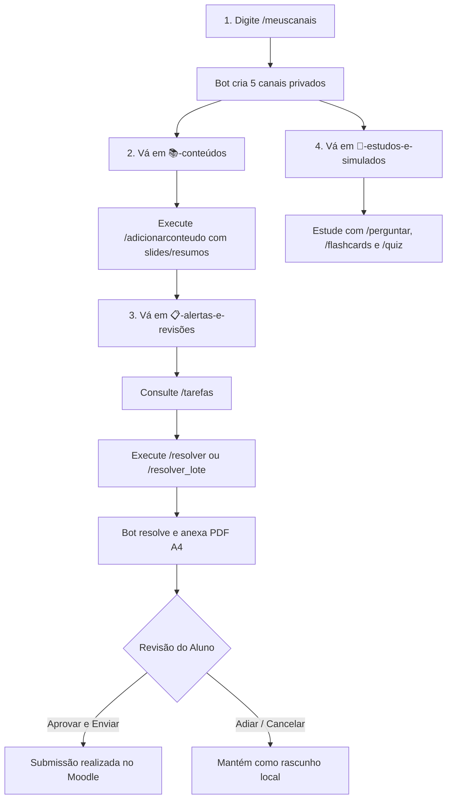

# Moodle AI Assistant (UFMG) 🎓

[](https://www.python.org/downloads/)
[](https://playwright.dev/)
[](https://discordpy.readthedocs.io/)
[](https://aistudio.google.com/)
[](#segurança-e-diretrizes-éticas)

Assistente inteligente em segundo plano (*background daemon*) para estudantes da Universidade Federal de Minas Gerais (UFMG). O sistema monitora o Moodle (`virtual.ufmg.br` / `moodle.grad.ufmg.br`), cataloga automaticamente materiais didáticos e avisos, gera rascunhos de exercícios e questionários com Inteligência Artificial contextualizada (RAG) e envia relatórios diagramados em PDF A4 para aprovação humana obrigatória via Discord.

---

## ⚡ Principais Funcionalidades

- **Monitoramento em Segundo Plano:** Daemon autônomo com varreduras periódicas que identifica novas atividades, questionários e comunicados dos professores no fórum de notícias.
- **Salas Privadas Multi-Usuário no Discord:** Com o comando `/meuscanais`, o bot provisiona uma categoria privada com 5 canais exclusivos para cada estudante no mesmo servidor, garantindo privacidade individual com isolamento de permissões.
- **RAG Acadêmico Local & Upload Complementar:** Baixa automaticamente slides e apostilas postados pelos professores (`storage/materials/<disciplina>/`) e permite que o aluno envie listas, anotações e resumos adicionais com `/adicionarconteudo`.
- **Resolução Inteligente & em Lote:** Comandos `/resolver` e `/resolver_lote` com 3 níveis de autonomia (`Apenas Resolver`, `Resolver e Preencher`, `Resolver e Enviar Tudo`) e exportação de relatórios em PDF formatados segundo padrões acadêmicos da UFMG.
- **Central de Estudos Ativos:**
  - `/perguntar`: Tutor acadêmico que tira dúvidas conceituais citando expressamente os slides e apostilas da disciplina.
  - `/flashcards`: Gera baralhos de repetição espaçada com carrossel interativo no Discord e arquivo `.txt` pronto para importação no Anki.
  - `/quiz`: Simulado interativo pré-prova com botões de múltipla escolha (A, B, C, D), correção instantânea e explicação de pegadinhas.
- **Arquitetura Multi-IA (BYOK) com Fallback:** Suporte nativo a Google Gemini (`gemini-3.5-flash`, `gemini-3.8-flash`), Anthropic Claude (`claude-haiku-4-5`) e DeepSeek (`deepseek-flash` com raciocínio CoT), com alternância automática em caso de instabilidade ou limite de cota.
- **Aprovação Humana Obrigatória (Human-in-the-Loop):** Nenhuma atividade é submetida ao Moodle sem que o estudante visualize o rascunho, o PDF e clique no botão `[✅ Aprovar e Enviar]`.

---

## 🔒 Arquitetura dos Canais Privados no Discord

Ao entrar no servidor compartilhado ou executar o comando `/meuscanais`, o bot cria uma categoria privada (`🔒 Moodle • SeuNome`) com 5 salas exclusivas:

| Canal | Propósito | Comandos Recomendados |
| :--- | :--- | :--- |
| 📋 **`alertas-e-revisões`** | Painel de atividades pendentes, prazos críticos, notas lançadas e botões de revisão interativa | `/tarefas`, `/resolver`, `/refazer` |
| 📚 **`conteúdos`** | Repositório de materiais didáticos da matéria e envio de resumos complementares para a base de conhecimento | `/adicionarconteudo`, `/materiais` |
| 📢 **`avisos-da-turma`** | Feed automático de comunicados e mensagens postadas pelos docentes no fórum do Moodle | Feed automático de avisos |
| ⚡ **`fila-de-tarefas`** | Acompanhamento de execuções assíncronas e log de processamento de lotes em tempo real | `/resolver_lote` |
| 🎯 **`estudos-e-simulados`** | Ambiente focado em fixação de conteúdo, dúvidas teóricas e preparação para provas | `/perguntar`, `/flashcards`, `/quiz` |

> [!NOTE]
> Todos os canais criados possuem permissões estritas: o cargo `@everyone` não tem permissão de visualização. Somente você e o bot têm acesso à sua categoria.

---

## 📖 Fluxo de Uso Prático (Passo a Passo)

Veja a seguir a jornada típica de um estudante utilizando o assistente no dia a dia:



### 1. Criar suas Salas Privadas
Em qualquer canal do servidor do Discord onde o bot esteja presente, digite:
```text
/meuscanais
```
*(Alternativa por texto: `!meuscanais`)*

O bot criará instantaneamente sua categoria pessoal e os 5 canais privados, respondendo com um resumo das salas geradas.

---

### 2. Adicionar Materiais e Resumos da Disciplina
Entre no seu canal **`📚-conteúdos`** e execute o comando:
```text
/adicionarconteudo disciplina: "Cálculo I" arquivo: [anexar resumo_p1.pdf]
```
- O bot faz o download do arquivo, cataloga em `storage/materials/Calculo_I/` e indexa o conteúdo no motor RAG.
- A partir desse momento, todas as resoluções e respostas do tutor usarão esse material como fonte de consulta prioritária.

---

### 3. Visualizar Atividades e Prazos
Vá para o canal **`📋-alertas-e-revisões`** e confira as tarefas pendentes:
```text
/tarefas
```
O bot exibirá uma lista categorizada por prazos:
- 🔴 **Urgente:** Menos de 24 horas restantes.
- 🟡 **Atenção:** Entre 24 horas e 3 dias.
- 🟢 **No prazo:** Mais de 3 dias para a entrega.
- ⚪ **Entregues:** Atividades já enviadas no Moodle.

---

### 4. Resolver uma Atividade com IA
Ainda no canal **`📋-alertas-e-revisões`**, inicie a resolução:
```text
/resolver tarefa: "Lista 1 - Limites e Derivadas" modo: "Apenas Resolver" instrucoes: "Justifique cada passo com detalhes e cite os teoremas utilizados"
```

Modos disponíveis:
1. **Apenas Resolver:** Analisa os enunciados, consulta os materiais da disciplina e gera o rascunho completo acompanhado de um relatório acadêmico em PDF formatado.
2. **Resolver e Preencher:** Resolve a atividade, entra na página do Moodle via navegador e preenche os campos do envio sem finalizar a submissão.
3. **Resolver e Enviar Tudo:** Resolve, preenche e submete no Moodle automaticamente (destinado a rotinas em que você já validou a metodologia).

> [!TIP]
> Se tiver muitas atividades pendentes na semana, use o comando `/resolver_lote`. Ele abrirá um menu de seleção múltipla permitindo resolver vários exercícios de forma sequencial com acompanhamento no canal `⚡-fila-de-tarefas`.

---

### 5. Revisar e Aprovar a Submissão
Ao concluir a resolução, o bot envia uma mensagem no Discord contendo:
- O texto completo da resolução e respostas.
- O documento acadêmico em PDF anexado (diagramado com cabeçalho institucional, código com realce de sintaxe e paginação).
- Três botões de ação:
  - `[✅ Aprovar e Enviar]`: O assistente abre a sessão do Moodle via Playwright e realiza o envio oficial.
  - `[⏱️ Adiar]`: Mantém o rascunho salvo e silencia o alerta temporariamente.
  - `[❌ Cancelar / Não Enviar]`: Descarta o envio automatizado.

---

### 6. Estudar e Praticar para Provas
Acesse o canal **`🎯-estudos-e-simulados`** para utilizar a suíte pedagógica:

- **Tirar dúvidas conceituais:**
  ```text
  /perguntar disciplina: "Física Básica" duvida: "Qual a diferença física entre campo elétrico conservativo e não-conservativo?"
  ```
- **Gerar baralho de flashcards para o Anki:**
  ```text
  /flashcards disciplina: "Cálculo I" topico: "Regra da Cadeia" qtd: 8
  ```
  *(O Discord exibe um carrossel interativo e anexa o arquivo `.txt` para importação direta no Anki).*
- **Iniciar um simulado pré-prova:**
  ```text
  /quiz disciplina: "Química Geral" qtd_questoes: 5 topico: "Termodinâmica Química"
  ```
  *(Simulado interativo com botões A, B, C, D, pontuação em tempo real e explicação dos distratores).*

---

## 💻 Instalação e Execução no Windows (Zero Friction)

O repositório inclui utilitários em lote (`.bat`) para instalação e uso simplificado sem necessidade de conhecimentos avançados de terminal:

```text
├── instalar.bat     # ⚡ Instalador com 1 clique (Python, venv, Playwright e abre a interface)
├── configurar.bat   # 🖥️ Painel Gráfico de Configurações e Auto-Detecção dos canais do Discord
├── iniciar.bat      # 🚀 Inicializador diário com sincronização segura e execução do daemon
└── atualizar.bat    # 🔄 Atualizador manual de código e dependências
```

### Passo 1: Instalação Automática
1. Clone ou baixe este repositório no seu computador:
   ```cmd
   git clone https://github.com/seu-usuario/moodle-bot.git
   cd moodle-bot
   ```
2. Dê um duplo clique no arquivo [`instalar.bat`](file:///c:/moodle-bot/instalar.bat).
3. O instalador cuidará de:
   - Detectar ou instalar o Python 3.10+.
   - Criar o ambiente virtual isolado `.venv`.
   - Instalar todas as bibliotecas necessárias.
   - Instalar os binários do navegador Chromium para o Playwright.
   - Gerar o seu `.env` inicial e abrir o painel de configurações.

---

### Passo 2: Configuração via Painel Gráfico
Ao abrir o [`configurar.bat`](file:///c:/moodle-bot/configurar.bat), uma interface gráfica será exibida no seu navegador:

1. **Autenticação Moodle:** Clique em **"Testar Conexão / Fazer Login"** para abrir a janela do MinhaUFMG, digitar suas credenciais e concluir o 2FA. A sessão é salva com segurança em `storage/cookies/session.json`.
2. **Provedor de IA (BYOK):** Insira sua chave de API gratuita do [Google AI Studio](https://aistudio.google.com/) (ou chaves de Claude / DeepSeek se preferir).
3. **Auto-Detecção do Discord:**
   - Insira o token do seu bot do Discord.
   - No campo **"Seu Usuário / ID do Discord"**, digite seu usuário e clique em **"🔍 Auto-Detectar"**.
   - O assistente buscará sua categoria privada no Discord e preencherá automaticamente os 5 IDs de canal!

---

### Passo 3: Inicialização Diária
Para rodar o assistente no dia a dia, execute [`iniciar.bat`](file:///c:/moodle-bot/iniciar.bat). Ele verifica atualizações remotas de forma segura sem alterar seus arquivos de credenciais e inicia o daemon de monitoramento e o bot do Discord.

---

## 🐧 Instalação Manual (Linux / Servidor / Docker)

Caso prefira rodar em ambiente Linux ou servidor dedicado:

```bash
# 1. Clone o repositório
git clone https://github.com/seu-usuario/moodle-bot.git
cd moodle-bot

# 2. Crie e ative o ambiente virtual
python3 -m venv .venv
source .venv/bin/activate

# 3. Instale as dependências
pip install -r requirements.txt
playwright install chromium

# 4. Configure o arquivo .env
cp .env.example .env
# Edite as variáveis no .env com suas chaves e tokens

# 5. Inicie o daemon e bot
python -m src.scheduler.daemon
```

---

## ⌨️ Tabela Geral de Comandos do Discord

| Comando | Descrição | Parâmetros |
| :--- | :--- | :--- |
| `/meuscanais` | Cria ou localiza suas 5 salas privadas no servidor | *(Nenhum)* |
| `/tarefas` | Lista tarefas abertas, prazos e atividades entregues | `[disciplina]` *(opcional)* |
| `/adicionarconteudo` | Salva materiais didáticos e resumos na memória da IA | `disciplina`, `arquivo` |
| `/materiais` | Envia os slides e materiais catalogados da matéria | `disciplina` |
| `/resolver` | Resolve uma tarefa ou questionário com apoio da IA | `tarefa`, `[modo]`, `[instrucoes]`, `[arquivo]` |
| `/refazer` | Refaz uma tarefa já entregue aplicando novas instruções | `tarefa`, `[instrucoes]`, `[arquivo]` |
| `/resolver_lote` | Menu interativo para resolver múltiplas tarefas em sequência | `[disciplina]`, `[instrucoes]`, `[arquivo]` |
| `/perguntar` | Tutor acadêmico com citação de apostilas e slides | `disciplina`, `duvida`, `[material]` |
| `/flashcards` | Baralho de repetição espaçada e arquivo para Anki | `disciplina`, `[topico]`, `[qtd]`, `[material]` |
| `/quiz` | Simulado interativo pré-prova com botões de múltipla escolha | `disciplina`, `[qtd_questoes]`, `[topico]`, `[material]` |
| `/status` | Telemetria do sistema, cookies, IA e fila de tarefas | *(Nenhum)* |
| `/notion_sync` | Sincroniza tarefas pendentes com seu banco no Notion | *(Nenhum)* |
| `/atualizar_checklist` | Atualiza a checklist diária no Notion | *(Nenhum)* |

---

## 📂 Estrutura do Projeto

```text
moodle-bot/
├── config/                 # Módulo de configurações e parsing de variáveis de ambiente
│   ├── __init__.py
│   └── settings.py
├── src/
│   ├── auth/               # Autenticação MinhaUFMG / Moodle via Playwright
│   ├── scraper/            # Coleta de tarefas, questionários, avisos e downloads
│   ├── solver/             # Motores de IA (Gemini, Claude, DeepSeek) e gerador de PDF
│   ├── notifier/           # Bot do Discord (slash commands, botões interativos e views)
│   ├── scheduler/          # Background daemon, fila assíncrona e persistência de estado
│   └── ui/                 # Servidor web local para painel gráfico de configuração
├── storage/                # Armazenamento em runtime (ignorado pelo git)
│   ├── cookies/            # Cookies de sessão autenticada (session.json)
│   ├── materials/          # Slides e apostilas catalogados por disciplina
│   └── submissions/        # Rascunhos e PDFs gerados para envio
├── tests/                  # Suíte de testes automatizados com pytest
├── .env.example            # Modelo de variáveis de ambiente
├── .gitignore              # Regras estritas de exclusão de segredos e sessões
├── instalar.bat            # Script de instalação com 1 clique (Windows)
├── configurar.bat          # Inicializador do painel gráfico local
├── iniciar.bat             # Inicializador diário com auto-updater
├── requirements.txt        # Dependências Python
└── README.md               # Documentação oficial do projeto
```

---

## 🛡️ Segurança e Diretrizes Éticas

> [!IMPORTANT]
> O Moodle AI Assistant foi desenvolvido como ferramenta de apoio aos estudos e gerenciamento de produtividade acadêmica.

- **Human-in-the-loop Obrigatório:** O bot **nunca** submete trabalhos de forma silenciosa ou sem autorização explícita do estudante.
- **Proteção Contra Sobrescrita:** Se o sistema detectar que uma atividade já possui envio manual prévio ("Editar envio"), a submissão automatizada é abortada para resguardar o trabalho original do aluno.
- **Proibições Estritas em Fóruns e Mensagens:** O assistente não possui nenhuma função ou permissão de interação em fóruns de discussão nem de envio de mensagens diretas para professores ou colegas.
- **Segredos e Credenciais:** Senhas, tokens de API e cookies de sessão residem exclusivamente na sua máquina local em `.env` e `storage/cookies/`, sendo estritamente ignorados pelo controle de versão.
