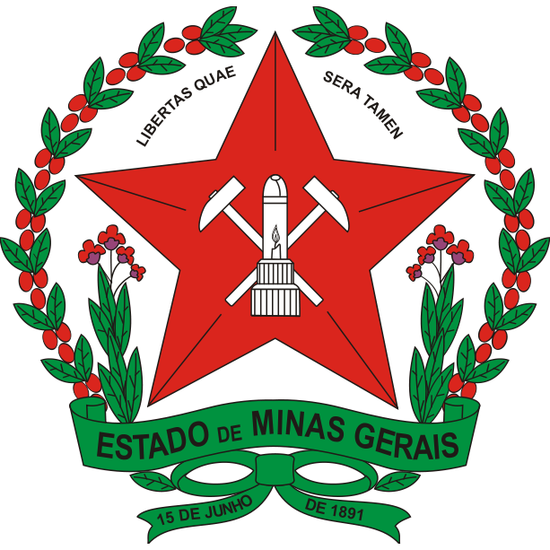

<div align="center">
  
  <h1>LumiBot</h1>
  <p><strong>Assistente acadêmico Multi-LMS com suporte a Moodle e Canvas LMS, integração com Discord e resolução assistida por modelos de linguagem.</strong></p>

  <p>
    <a href="https://www.python.org/downloads/"></a>
    <a href="https://discordpy.readthedocs.io/"></a>
    <a href="https://playwright.dev/"></a>
    <a href="https://canvas.instructure.com/doc/api/"></a>
    <a href="#seguran%C3%A7a-e-diretrizes-%C3%A9ticas"></a>
  </p>
</div>

---

## Visão Geral

O **LumiBot** é um serviço em segundo plano projetado para automação acadêmica e consolidação de tarefas educacionais. O sistema monitora continuamente ambientes virtuais de aprendizagem, cataloga arquivos didáticos e comunicados oficiais, gera rascunhos fundamentados de exercícios com apoio de modelos de linguagem e viabiliza a submissão de atividades mediante aprovação humana direta via Discord.

O projeto opera sob uma arquitetura de provedores desacoplados, permitindo integrar simultaneamente ou de forma isolada portais baseados em **Moodle** e **Canvas LMS**.

---

## Arquitetura Multi-LMS

O LumiBot padroniza dados acadêmicos (disciplinas, tarefas, prazos e avisos) em um modelo comum, independentemente da plataforma de origem:

```
[ Canvas LMS (API REST) ] ──┐
                            ├─► [ BaseLMSProvider ] ──► [ Daemon & Discord Bot ]
[ Moodle (Playwright)   ] ──┘
```

- **Canvas LMS (Instructure):** Integração direta com a API REST oficial v1 utilizando autenticação por Bearer Token. Realiza consultas paginadas de disciplinas ativas, tarefas pendentes e comunicados. O envio de atividades segue o protocolo oficial em três etapas da Instructure: notificação de upload, transmissão multipart do binário e confirmação de entrega.
- **Moodle:** Integração automatizada baseada no navegador Chromium (Playwright), compatível com instâncias institucionais que exigem autenticação centralizada (SSO). Suporta persistência de sessão por cookies locais ou autenticação via credenciais.
- **Modo Multi-LMS:** Sincroniza ambos os provedores simultaneamente, apresentando uma fila unificada de tarefas e materiais no Discord.

---

## Requisitos do Sistema

Antes de iniciar, certifique-se de que o seu ambiente atende aos seguintes requisitos:

- **Sistema Operacional:** Windows 10/11 ou distribuições Linux x86_64.
- **Python:** Versão 3.10, 3.11 ou 3.12 instalada e adicionada ao PATH do sistema.
- **Conexão com a Internet:** Acesso aos portais educacionais e às APIs dos provedores de IA selecionados.
- **Aplicação no Discord:** Bot criado no [Discord Developer Portal](https://discord.com/developers/applications) com as permissões de `Send Messages`, `Attach Files` e as seguintes *Privileged Gateway Intents* ativadas:
  - `Message Content Intent`
  - `Server Members Intent`

---

## Instalação Rápida (Windows)

O repositório fornece scripts de automação para facilitar a inicialização e manutenção:

1. **Clonar ou Baixar o Repositório:**
   ```cmd
   git clone https://github.com/seu-usuario/moodle-bot.git
   cd moodle-bot
   ```

2. **Instalar Dependências:**
   Execute o arquivo `instalar.bat` com duplo clique. O script criará o ambiente virtual isolado (`.venv`), instalará os pacotes necessários via `pip` e baixará os binários do Chromium necessários para o Playwright.

3. **Configurar o Sistema:**
   Execute `configurar.bat` para abrir o Painel Web de Configuração no navegador.

4. **Iniciar o Serviço:**
   Execute `iniciar.bat`. O assistente realizará as checagens pré-voo, validará as conexões configuradas e iniciará o monitoramento automático.

---

## Configuração Passo a Passo

Toda a configuração pode ser realizada pelo arquivo `.env` ou pela interface visual executando `configurar.bat`.

### 1. Painel Web de Configuração

Ao executar `configurar.bat`, o assistente inicia um servidor local e abre o painel em `http://127.0.0.1:5055`:

- **Aba "Plataformas LMS":** Selecione a arquitetura desejada:
  - *Multi-LMS (Ambas):* Exibe as abas de configuração do Canvas e do Moodle.
  - *Canvas LMS:* Exibe apenas as opções do Canvas.
  - *Moodle:* Exibe apenas as opções do Moodle.
- **Botão "Salvar Configurações (.env)":** Grava as preferências diretamente no arquivo `.env` local.

---

### 2. Configuração do Canvas LMS

Para integrar sua conta do Canvas:

1. Acesse o portal da sua instituição no navegador (exemplo: `https://pucminas.instructure.com`).
2. Clique na sua foto de perfil (**Conta**) no menu lateral e selecione **Configurações**.
3. Role a página até a seção **Tokens de Acesso Aprovados** e clique em **+ Novo Token de Acesso**.
4. Defina uma finalidade (exemplo: `LumiBot`), clique em **Gerar Token** e copie o código gerado.
5. No painel de configuração (ou no `.env`), preencha:
   - **URL Base:** `https://pucminas.instructure.com` (ou a URL da sua universidade).
   - **Token de Acesso da API:** Cole o token gerado.
6. Clique em **Testar Conexão** para validar a autenticação.

---

### 3. Configuração do Moodle

Para portais que utilizam Moodle:

1. Informe a **URL Base do Moodle** (exemplo: `https://virtual.ufmg.br`).
2. Escolha a modalidade de autenticação:
   - **Cookies de Sessão:** Clique em **Login Interativo** para abrir o navegador, efetuar o login institucional com duplo fator (2FA) e salvar a sessão.
   - **Credenciais Automáticas:** Informe o usuário e a senha institucionais para que o bot renove o acesso automaticamente em segundo plano.
3. Teste a conectividade pelo botão correspondente.

---

### 4. Configuração dos Provedores de Inteligência Artificial (BYOK)

O sistema utiliza arquitetura de chaves próprias (*Bring Your Own Key*) com suporte a alternância automática (*fallback*) em caso de instabilidade:

- **Google Gemini (Padrão):** Obtenha uma chave gratuita no [Google AI Studio](https://aistudio.google.com/) e configure `GEMINI_API_KEY`.
- **DeepSeek:** Suporte aos modelos `deepseek-chat` e `deepseek-flash` com raciocínio analítico (Chain of Thought). Informe `DEEPSEEK_API_KEY`.
- **Anthropic Claude:** Suporte a modelos Claude 3.5 Sonnet e Claude 3.5 Haiku. Informe `ANTHROPIC_API_KEY`.

---

## Comandos do Discord

Após iniciar o bot com `iniciar.bat`, os comandos de barra (*slash commands*) estarão disponíveis no seu servidor:

| Comando | Descrição | Parâmetros |
| :--- | :--- | :--- |
| `/meuscanais` | Cria a categoria privada e os canais de trabalho individuais do estudante | *(Nenhum)* |
| `/tarefas` | Lista tarefas pendentes e concluídas com classificação de urgência | `disciplina` *(opcional)* |
| `/canvas` | Consulta informações do Canvas (tarefas, disciplinas ativas, comunicados ou diagnóstico) | `consulta`, `dias` |
| `/resolver` | Analisa o enunciado, consulta os materiais da matéria e gera resolução formatada | `tarefa`, `modo`, `instrucoes` |
| `/resolver_lote` | Abre menu interativo para processar múltiplas atividades pendentes | `disciplina`, `instrucoes` |
| `/materiais` | Envia arquivos e slides catalogados de uma disciplina | `disciplina` |
| `/adicionarconteudo` | Faz o upload de anotações ou listas complementares para o repositório da disciplina | `disciplina`, `arquivo` |
| `/perguntar` | Tutor conceitual que esclarece dúvidas citando materiais catalogados | `disciplina`, `duvida` |
| `/flashcards` | Cria baralho de revisão espaçada com exportação compatível com o Anki | `disciplina`, `topico`, `qtd` |
| `/quiz` | Gera simulado de múltipla escolha com correção e explicação de alternativas | `disciplina`, `qtd_questoes` |
| `/status` | Exibe diagnóstico de conectividade, status das sessões e modelo de IA ativo | *(Nenhum)* |

---

## Fluxo de Trabalho e Segurança (Human-in-the-Loop)

> [!IMPORTANT]
> O LumiBot adota o princípio estrito de supervisão humana (*Human-in-the-Loop*). Nenhuma atividade acadêmica é enviada ao portal sem validação explícita.

Ao solicitar a resolução de uma tarefa pelo comando `/resolver`:

1. **Processamento:** O motor consulta os materiais da disciplina e elabora a resposta estruturada.
2. **Geração do Documento:** É produzido um documento acadêmico diagramado (em PDF ou DOCX) contendo desenvolvimento passo a passo e identificação das fontes.
3. **Revisão Interativa no Discord:** O bot publica o resultado acompanhado de botões de ação:
   - `[Aprovar e Enviar]`: Executa o protocolo de envio oficial para o Canvas ou Moodle.
   - `[Adiar]`: Mantém o rascunho arquivado sem realizar o envio.
   - `[Cancelar]`: Descarta a proposta de submissão.

---

## Execução em Ambiente Linux ou Servidor

Para executar em servidores dedicados ou distribuições Linux:

```bash
# 1. Clonar o repositório
git clone https://github.com/seu-usuario/moodle-bot.git
cd moodle-bot

# 2. Criar e ativar ambiente virtual
python3 -m venv .venv
source .venv/bin/activate

# 3. Instalar dependências e navegadores
pip install -r requirements.txt
playwright install chromium

# 4. Configurar variáveis de ambiente
cp .env.example .env
nano .env

# 5. Executar o daemon
python -m src.scheduler.daemon
```

---

## Diretrizes de Uso e Segurança

- **Isolamento de Credenciais:** Tokens de acesso, senhas e cookies de autenticação são armazenados exclusivamente na máquina local (`.env` e diretório `storage/`). Nenhum dado de acesso é transmitido para servidores de terceiros além dos endpoints oficiais dos provedores configurados.
- **Proteção de Envios Existentes:** Caso o sistema detecte que uma atividade já possui submissão manual registrada pelo estudante, o envio automático é cancelado para evitar sobrescrita acidental.
- **Restrição de Ações:** O assistente não possui rotinas de interação em fóruns públicos, envio de mensagens diretas nem alteração de dados cadastrais dos usuários nas plataformas educacionais.
